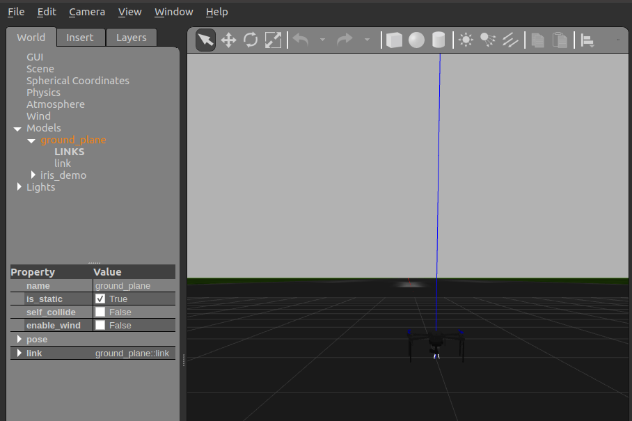

# Run SITL and gazebo

Using two launch files:  
- from rosmav pkg run `sitl.gazebo.launch.py`  
- from wasp_gazebo run `gazebo.launch.py`


```bash title="terminal1"
ros2 launch rosmav sitl.gazebo.launch.py
```

```bash title="terminal2"
ros2 launch wasp_gazebo gazebo.launch.py
```
